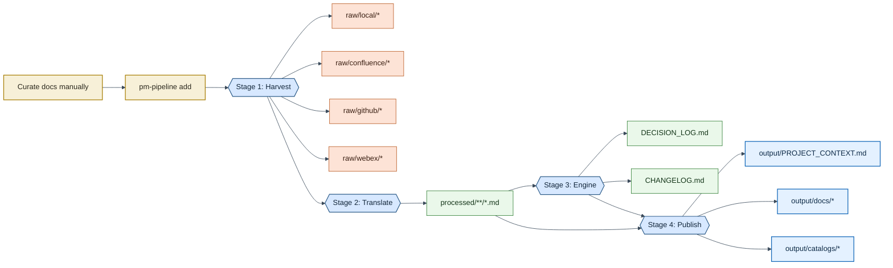
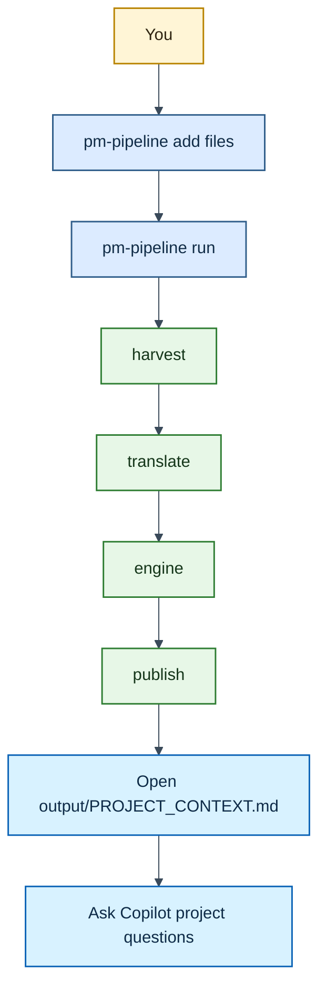
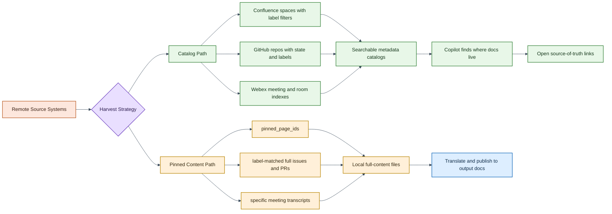

# PM Doc Pipeline

**Curated Doc-as-Code pipeline for Product Managers.**

Stage the documents that matter, convert them to clean Markdown, and let VS Code Copilot search your knowledge base. Everything runs locally — no GPUs, no cloud AI, no data leaves your machine.

Copilot project guidance: see `.github/copilot-instructions.md`.

---

## Philosophy: You Curate, Pipeline Formats
This is **not** a data warehouse. It's a focused knowledge base.

- **You pick** the 10-50 documents that matter right now (a PRD, a sprint deck, key meeting notes)
- **Pipeline converts** them to clean, searchable Markdown with metadata
- **Copilot searches** a tight, high-signal set it can actually reason about

Remote sources (Confluence, GitHub) produce **metadata catalogs** — searchable indexes with links back to the source of truth — not full content copies that go stale.

---

## Quick Start

### 1. Create and activate a virtual environment (Linux/macOS)

```bash
python3 -m venv .venv
source .venv/bin/activate
```

For Fish shell:

```bash
python3 -m venv .venv
source .venv/bin/activate.fish
```

### 2. Install dependencies and CLI

```bash
pip install --upgrade pip setuptools wheel
pip install -e .
```

### 3. Verify install

```bash
pm-pipeline --help
```

If editable install fails with `Cannot import 'setuptools.backends._legacy'`, check that `pyproject.toml` uses:

```toml
build-backend = "setuptools.build_meta"
```

If `pm-pipeline` is still not found after install, run:

```bash
hash -r
pm-pipeline --help
python3 -m src.cli --help
```

### 4. Stage some documents

```bash
pm-pipeline add ~/docs/sprint-deck.pptx
pm-pipeline add ~/docs/prd-v2.docx
pm-pipeline add ~/docs/meeting-notes.pdf
```

### 5. Run

```bash
pm-pipeline run
pm-pipeline status
```

### 6. Open in VS Code

Open `output/` in VS Code. Copilot can now search the generated project context and docs.

---

## Architecture

### Pipeline Architecture



### Command to Output Flow



---

## CLI Commands

| Command | What It Does |
|---|---|
| `pm-pipeline add <file> [file...]` | Stage document(s) for processing |
| `pm-pipeline remove <file>` | Remove a document from staging |
| `pm-pipeline list` | Show all staged files |
| `pm-pipeline run` | Run all 4 pipeline stages |
| `pm-pipeline run -s translate -s publish` | Run specific stages |
| `pm-pipeline status` | Show file counts and pipeline state |
| `pm-pipeline report` | Generate a weekly report from output artifacts |
| `pm-pipeline report -o path` | Generate report to a custom path |
| `pm-pipeline init` | Create project directories |

## Copilot Skills (Project-Scoped)

This repository ships chat skills under `.github/skills/` so Copilot can run common workflows directly from chat in this project.

Project operator agent:
- `.github/agents/pm-doc-pipeline-operator.agent.md`

Available skills:
- `/pm-doc-doctor`
- `/pm-doc-state-audit`
- `/pm-doc-report-weekly`

Skill behavior summary:

| Skill | Purpose | Default Mode | Writes Files |
|---|---|---|---|
| `/pm-doc-doctor` | setup/readiness diagnostics, install repair with --fix | read-only checks | no (unless --fix) |
| `/pm-doc-state-audit` | staging/raw/processed/output consistency audit | read-only checks | no |
| `/pm-doc-report-weekly` | weekly report via pm-pipeline report | runs CLI command | yes (report output) |

Usage example in Copilot Chat:

```text
/pm-doc-doctor --verbose
/pm-doc-report-weekly
```

Notes:
- These skills are repository-scoped and should work after cloning this repo and opening it in Copilot-enabled VS Code.
- They follow project rules in `.github/copilot-instructions.md`.
- They default to safe behavior (non-destructive unless explicitly requested).
- Weekly report uses existing output artifacts unless you explicitly ask to refresh the pipeline first.

### Token-Efficient Copilot Usage

1. For reporting and summaries, ask Copilot to use output artifacts first.
2. For docs-only updates, tell Copilot to skip `src/` unless verification is required.
3. Ask for minimal-file analysis when you want recommendations only.
4. Use `pm-doc-*` skills to constrain scope and reduce context bloat.

### Skill Contract and Validation

All project skills follow a shared contract with explicit sections for:
- inputs
- safety
- output contract
- verification checklist

Validation tracking lives in:
- `docs/skills-validation.md`

Default response envelope used by the operator/skills:
1. Summary
2. Findings
3. Actions
4. Verification

### Clone Portability Checklist

After cloning on a new machine, ensure:
1. VS Code has GitHub Copilot Chat enabled and signed in.
2. You open the repository root as the active workspace.
3. Repository guidance files exist:
    - `.github/copilot-instructions.md`
    - `.github/agents/pm-doc-pipeline-operator.agent.md`
    - `.github/skills/pm-doc-*/SKILL.md`
4. Python environment is ready (`.venv` + `pm-pipeline --help`).

### Typical daily workflow

```bash
# Morning: stage today's documents
pm-pipeline add ~/Downloads/standup-notes.docx
pm-pipeline add ~/Downloads/q3-roadmap.pptx

# Process
pm-pipeline run

# Open VS Code, ask Copilot:
#   "What decisions were made about the auth feature?"
#   "Summarize the Q3 roadmap"
#   "What tickets are referenced in today's standup notes?"
```

---

## How Each Stage Works

### Stage 1: Data Harvester

**Local files** — Only files you explicitly `pm-pipeline add` get processed. No auto-discovery, no watch-everything.

**Confluence** (optional) — Produces a **metadata catalog**: a searchable Markdown table with page titles, labels, authors, dates, and links back to Confluence. Only pages you "pin" by ID get full content downloaded.

**GitHub** (optional) — Produces a **catalog** of issues/PRs. Only label-matched items get full body + comments.

**Webex** (optional) — Downloads transcripts for specific meeting IDs you provide.

### Stage 2: Universal Translator

Converts every raw file to Markdown with YAML frontmatter:

| Input | Library | Output |
|---|---|---|
| PDF | pdfplumber (layout-aware) or PyMuPDF (fast) | Markdown with page breaks |
| DOCX | python-docx | Markdown preserving headings, lists, tables |
| PPTX | python-pptx | Markdown with slide-by-slide structure |
| HTML | markdownify | Clean Markdown (handles Confluence format) |
| JSON | built-in | Structured Markdown (GitHub issues/PRs) |
| VTT | built-in | Readable transcript with speaker labels |

### Stage 3: The Engine

All rule-based, deterministic, no AI:

- **Change Tracking** — GitPython diffs `processed/` against last commit
- **Ticket Extraction** — Regex patterns find JIRA-123, #456, etc.
- **Decision Detection** — Keyword matching ("decided", "approved", "action item") + context extraction
- **Changelog** — Groups changes by source, date, or ticket

### Stage 4: The Publisher

- Copies processed docs into flat `output/docs/`
- Writes `DECISION_LOG.md` and `CHANGELOG.md` at top level
- Generates `PROJECT_CONTEXT.md` — **the single file that ties everything together**

---

## PROJECT_CONTEXT.md — Why It Matters

`PROJECT_CONTEXT.md` is the file Copilot finds first. It contains:

- **Document inventory** — every processed file with title and source
- **All decisions** — extracted inline with context and ticket refs
- **Ticket references** — every ticket number found across all documents
- **Recent changes** — what changed in the latest pipeline run

When you open this file in VS Code, Copilot has a complete map of your knowledge base in one context window.

---

## Remote Sources: Catalogs, Not Copies

For a large enterprise, copying Confluence spaces locally is wrong — it creates stale duplicates and overwhelms Copilot.



Instead, the pipeline produces **catalogs**:

```markdown
## Space: PM

| Title              | Labels        | Last Modified | Author    | Link          |
|--------------------|---------------|---------------|-----------|---------------|
| Q3 Roadmap         | roadmap       | 2024-03-15    | Sgidy  | [Open](url)   |
| Auth Feature PRD   | prd, specs    | 2024-03-10    | sgidy the magnificent  | [Open](url)   |
```

Copilot can search this table to answer "where is the doc about X?" and give you the link. The source of truth stays in Confluence.

For the few pages you **need** locally (e.g., the active PRD), use `pinned_page_ids` in the config.

---

## Configuration

All settings live in `config/pipeline.yaml`. Credential variable names are documented in `config/.env.example`.

```bash
cp config/.env.example config/.env
# Edit config/.env with your tokens
```

Current runtime behavior: remote source harvesters read from process environment variables.
If you use `config/.env`, export those values into your shell before running.

Key config sections:

| Section | What to edit |
|---|---|
| `sources.confluence.spaces` | Space keys + label filters for the catalog |
| `sources.confluence.pinned_page_ids` | Specific pages to download fully |
| `sources.github.repos` | Repos + label filters |
| `sources.webex.meeting_ids` | Specific meetings to transcribe |
| `engine.ticket_patterns` | Regex for your ticket system (JIRA, GitHub, etc.) |
| `engine.decision_keywords` | Words that signal decisions |

---

## Library Stack

All offline, CPU-only, actively maintained:

| Category | Library | Why |
|---|---|---|
| PDF parsing | pdfplumber | Best layout-aware extraction; handles tables |
| PDF (fast mode) | PyMuPDF | 10-50x faster for simple text; configurable |
| Word parsing | python-docx | De facto standard; headings, tables, styles |
| PowerPoint | python-pptx | Only serious .pptx library; slides, shapes, tables |
| HTML → Markdown | markdownify | Clean, configurable; handles Confluence HTML |
| Confluence API | atlassian-python-api | Most complete Atlassian client; Cloud + Server |
| GitHub API | PyGithub | Mature; issues, PRs, labels, comments |
| Webex API | webexpythonsdk | Official community SDK; transcripts, messages |
| Config | PyYAML + pydantic | YAML parsing + optional schema validation |
| Git operations | GitPython | Change detection via diffs; no C deps |
| CLI | Click | Clean composable commands; Pallets project |

---

## Security & Privacy

- All document parsing runs locally (pdfplumber, python-docx, python-pptx, markdownify)
- Zero AI/LLM calls — all analysis is regex + keyword matching
- API credentials should stay in environment variables (optionally sourced from `config/.env`)
- Remote source raw data is gitignored
- The only network calls are to APIs you explicitly enable

---

## License

MIT
