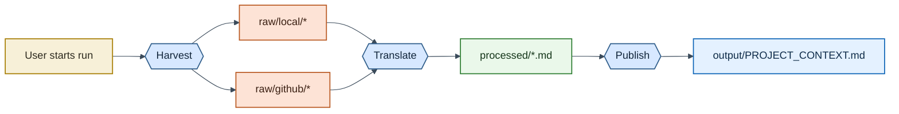

# Mermaid Default Style (Project Standard)

Use this style for all Mermaid diagrams in this project unless a user explicitly requests another theme.

## Shared Init Block

```mermaid
%%{init: {"theme": "base", "themeVariables": {"fontFamily": "Trebuchet MS, Verdana, sans-serif", "lineColor": "#3A4A5A", "primaryTextColor": "#1F2933", "tertiaryTextColor": "#1F2933"}}}%%
flowchart LR
```

## Shared Class Palette

```mermaid
flowchart LR
    classDef user fill:#F7F0D8,stroke:#A67C00,stroke-width:1.5px,color:#2D2A1F;
    classDef stage fill:#D7E8FF,stroke:#2F5D8A,stroke-width:1.5px,color:#12263A;
    classDef raw fill:#FDE3D6,stroke:#B8571F,stroke-width:1.5px,color:#3A1F12;
    classDef data fill:#EAF8EA,stroke:#2E7D32,stroke-width:1.5px,color:#15361A;
    classDef output fill:#E4F1FF,stroke:#0B63B6,stroke-width:1.5px,color:#0E2B47;
```

## Typical Mapping

- `user`: people, manual actions, or entry points.
- `stage`: pipeline stages and control nodes.
- `raw`: external systems, raw feeds, and source connectors.
- `data`: transformed data, logs, catalogs, and analysis artifacts.
- `output`: final deliverables and user-facing outputs.

## Minimal Example


